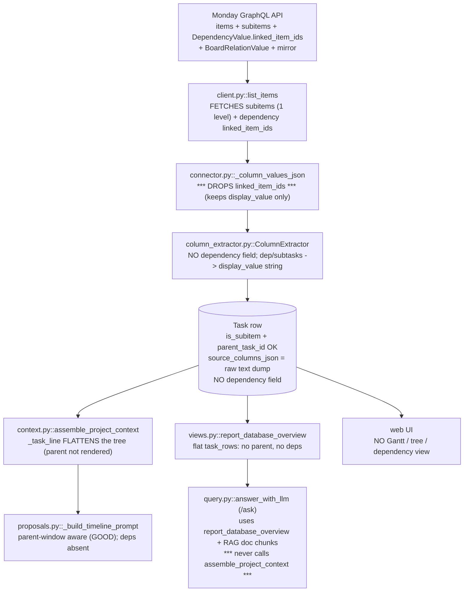

# Monday Integration Audit & Remediation Plan

**Date:** 2026-06-16. **Author:** deep audit pass (code + live DB).
**Status:** findings are evidence-backed (verified against the live
`project_db.sqlite`, not assumed). The remediation plan is the agreed
direction; Phase 1 begins after this doc lands.

> **One-sentence verdict:** Monday hands us a real task **graph** — hierarchy,
> dependencies, and a timeline — and the current pipeline degrades it into a
> flat list of strings before the LLM or the screen ever sees it. Ingestion of
> the *hierarchy* is genuinely fine; the *dependency graph* is discarded, and
> the LLM's access to *any* structure is impoverished.

---

## 1. How the data actually flows today



The load-bearing failures are the three starred boxes: edges dropped at
serialization, the `/ask` path never loading structured per-project context,
and no model field to hold dependencies in the first place.

---

## 2. Live-DB evidence (verified 2026-06-16)

| Metric | Value | Note |
|---|---|---|
| Projects | 22 | |
| Tasks (total) | 214 | |
| Subitems (`is_subitem`) | 129 | **all correctly parented** |
| Top-level tasks | 85 | |
| **Sub-subitems** | **0** | correct — Monday forbids them |
| Tasks with start+end date | 102 (~48%) | stale docs claim "11%" |
| Tasks with duration | 101 | |
| Tasks with `monday_status_label` | 142 | |
| Tasks with `assignee_id` | **0** | people column empty in Monday |
| Rockland tasks | 169 | a clean, rich tree |

Column types present in stored `source_columns_json` (across all tasks):
`text 338, people 213, board_relation 213, subtasks 211, status 146,
dependency 143, timeline 103, mirror 4, doc 2`.

**Dependency population (the key number):**

| Column | Total | Populated |
|---|---|---|
| `dependency` ("Dependent On") | 143 | **11** |
| `board_relation` (portfolio link) | 213 | 213 |

The 11 populated dependencies are a **real chain** (bathroom → plumbing →
drywall → plaster). Example stored value:

```
task='Drywall installation + existing drywall repair'
  display_value='Bathroom rough-in plumbing for bathroom reconfiguration,
                 Bathroom rough-in plumbing for washer/ dryer,
                 Kitchen rough-in plumbing reconfiguration'
  linked_item_ids=[]   <-- EMPTY: the IDs were fetched then dropped at storage
```

We kept the dependency *names* and threw away the *edges*.

---

## 3. Defects (ranked, with file:line evidence)

### D1 — Dependency edges are dropped at serialization, and unmodeled
- `connectors/monday/connector.py:325` `_column_values_json` keeps
  `id/title/type/text/value/label/number/from/to/display_value` and **omits
  `linked_item_ids`** — the very field the client fetched.
- `connectors/monday/client.py:199` *does* request
  `... on DependencyValue { display_value linked_item_ids }` — the data arrives
  and is then discarded downstream.
- `connectors/monday/connector.py:115` `_collect_linked_item_ids` scans
  `dependency` columns but only to follow the **portfolio mirror**, then drops
  them.
- `db/models/work.py:61` `Task` has **no dependency field** and there is no
  edge table. Nowhere to store a graph even if we kept it.
- `column_extractor.py:389` maps `dependency`/`subtasks`/`board_relation`/
  `mirror` to `display_value` text only; `ExtractedFields` (line 149) has no
  dependency field; `_TITLE_PATTERNS` (line 41) has no dependency pattern.

**Impact:** no dependency graph exists in the system. The 11 real edges live
only as comma-joined names inside a raw JSON blob.

### D2 — The `/ask` path is hierarchy- and dependency-blind
- `ai/query.py:214` `answer_with_llm` builds context from
  `report_database_overview` (line 255) + RAG document chunks. It **never calls
  `assemble_project_context`.**
- `ai/views.py:947` `report_database_overview` `task_rows` carry
  `title/status/dates/is_subitem` but **no `parent_task_id`, no parent name, no
  dependencies, no siblings** — and dump **all** tasks across **all** projects
  (capped 600), not the asked-about project's tree.

**Impact:** asking about a task gives the model a flat, project-mixed list with
no structure. This is the "the LLM is retarded" experience — it is blindfolded,
not stupid.

### D3 — The context assembler flattens the tree it already holds
- `ai/context.py:280` `_task_to_dict` includes `parent_task_id`, but
- `ai/context.py:330` `_task_line` renders a flat bullet, tags `[subitem]`
  (line 339) and **never names the parent or groups the tree**. Tasks are
  emitted in raw DB order.

**Impact:** even the structured path (`llm-test`, proposals via the generic
block) loses the hierarchy. Mitigation exists only in the timeline-proposal
prompt (`proposals.py:368-383`, parent-window bounding — this part is good).

### D4 — No structural visualization
- No Gantt, tree, or dependency view exists in `web/templates/`. The hierarchy
  + dates we already have are never drawn.

### D5 — Write-back cannot express dependencies
- `client.py` write mutations: `change_column_value` (396),
  `change_multiple_column_values` (440), `create_item` (484),
  `create_subitem` (530), `delete_item` (579). **No dependency mutation**
  (`update_dependency_column` / `batch_update_dependency_column`), so even once
  modeled we cannot propose/write an edge back to Monday.

### What genuinely works (keep it)
- Subitem ingestion (one level) with correct parent linkage —
  `connector.py:720-774`, `_upsert_task:795`.
- Portfolio mirror overlay — `connector.py:240`, `client.py:303`
  `get_items_with_mirror_values`.
- Timeline-proposal parent-window bounding — `proposals.py:368-383`.
- Delta-sync gate via `activity_logs` — `client.py:607`.

---

## 4. Remediation plan (phased)

**Phase 1 — Graph foundation (data layer).**
1. `TaskDependency` edge table (`predecessor_task_id`, `successor_task_id`,
   `source`, unique pair) + idempotent SQLite migration.
2. Stop dropping edges: retain `linked_item_ids` for `dependency` (and
   `board_relation`) in `_column_values_json`.
3. At sync, resolve Monday item IDs -> canonical Task IDs via `ExternalId` and
   upsert `TaskDependency` rows. Fall back to in-project title match on
   `display_value` for columns where only names are returned.
4. Tests + a live re-sync that reproduces the 11 Rockland edges as real rows.

**Phase 2 — Make the LLM see the graph.**
5. One `build_task_tree_block(tasks, deps)` renderer: hierarchy-indented,
   each task annotated `[blocked by: ...] [blocks: ...]`, status + dates.
   Reused by `/ask`, proposals, and field notes.
6. Fix `/ask`: when a question names a project/task, load that project's
   structured tree (hierarchy + deps + dates) into context, not the flat
   overview.

**Phase 3 — Visualize it.**
7. Deterministic Gantt/tree view on the project page (dates + hierarchy +
   dependency arrows). No LLM; recomputed free, like the briefing.

**Phase 4 — Close the write loop.**
8. `update_dependency_column` mutation + a `dependency` proposal type so the
   LLM can *suggest* edges (human-approved) — the brief's "build the graph
   over time" idea, advisor-not-actor (A1).

Phases 1-2 are the substance (they fix D1-D3). Phase 3 is the visibility you
asked for. Phase 4 lets the system improve the board instead of only reading it.
