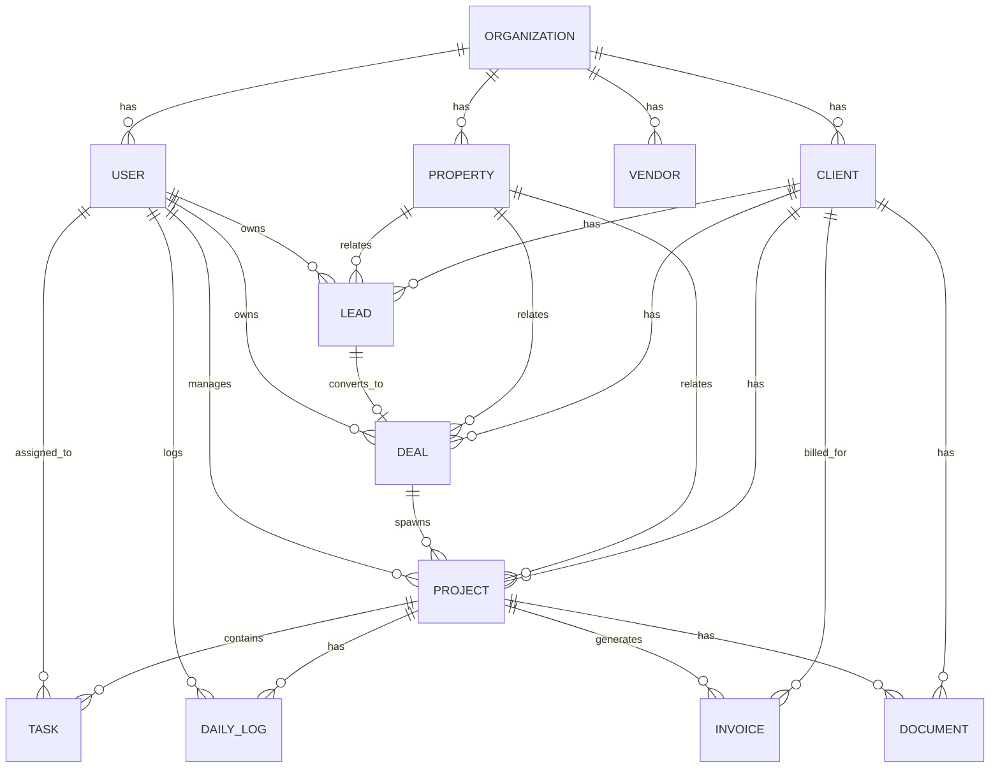

# Project Database Architecture — Design Doc v0.1

## Overview

Goal: unify operational, financial, and document data from disparate SaaS tools into a single queryable layer, with an AI assistant on top for natural-language Q&A, reporting, and dashboards.

**Source systems:**

- **Monday.com** — Work management (projects, tasks, team structure) + CRM (leads, contacts, pipeline)
- **CompanyCam** — Site photos/videos, deficiencies, daily logs
- **QuickBooks** — Expenses, invoices, payments, financial reports
- **Google Drive** — Documents, reports, quotes, contracts

**Target consumers:**

- AI Assistant (Q&A, summaries, reports, dashboards)
- *(Future)* BI dashboards, custom internal tools, mobile apps

---

## Core Principle: Canonical IDs

The single most important decision in this whole design. Every record in every source system must resolve to a **canonical entity** in the central layer. Without this, the AI can't answer "show me everything about Project X" because Project X has four different IDs across four systems.

### Two viable approaches

**Option A — One system is source of truth for IDs.**
Monday.com is the natural candidate (it's where projects typically start). Other systems reference its IDs in custom fields (e.g., the Monday Project ID gets written into the QuickBooks Job Number).

- ✅ Simple. No mapping table.
- ❌ Brittle. If a project gets created in QuickBooks first (common for finance-led teams), or a CompanyCam project is created on-site before the office sets it up in Monday, you get orphans. Migrating later is painful.

**Option B — Central layer issues canonical IDs; mapping table tracks externals.** ← *Recommended*

- Central DB has its own UUIDs for every entity (Project, Client, Vendor, etc.)
- An `external_ids` mapping table links canonical ↔ `{monday_id, qb_id, companycam_id, drive_folder_id, …}`
- ✅ Flexible. Survives source-system migrations. Handles records created in any system first.
- ❌ One more table to maintain. Dedup logic needed.

### Dedup / matching logic

When records arrive from multiple systems, the layer needs to decide if they refer to the same entity. Heuristics:

- **Exact match** on a manually-entered "external ref" field (e.g., the Monday project ID written into the QB job number).
- **Fuzzy match** on name + address for clients.
- **Flag conflicts for manual review** rather than auto-merging — silent merges create the worst kind of bug.

Reality check: **expect a one-time cleanup project** before this works smoothly. Existing data in all four systems was created independently and won't line up cleanly without effort.

---

## Entity Model (v0.1)

v0.1 covers only the canonical schema implemented in `src/project_db/db/models`.
The full target model (future scope) is in `docs/model-full.ump`.

ExternalId applies to every canonical entity; the diagram omits most of those
edges for readability.

### Entities and primary sources

| Entity | Source of truth | Also touches |
|---|---|---|
| Organization | Internal | — |
| Team Member / User | Monday | All systems (account mappings) |
| Client | Monday CRM | QuickBooks (customer), Drive (folder) |
| Vendor / Subcontractor | QuickBooks | Monday (if you track sub assignments) |
| Property | Monday Work Mgmt | CompanyCam (project), Drive (folder) |
| Lead / Deal | Monday CRM | — |
| Project / Job | Monday Work Mgmt | QuickBooks (job), CompanyCam (project), Drive (folder) |
| Task | Monday | — |
| Daily Log | CompanyCam | — |
| Invoice | QuickBooks | Drive (PDF) |
| Document | Drive | — |
| ExternalId mapping | Internal | Links all sources to canonical IDs |

### Out of scope in v0.1 (see model-full.ump)

- Media and Deficiency/Punchlist
- PurchaseOrder, Payment, Expense, Quote, Contract
- Activity and Workspace
- SyncJob, SyncError, ConnectorConfig
- AI entities (Conversation, Query, Report, EmbeddingChunk)

---

## Central Data Layer — Tech Choices

For this scope (one company, dozens to low-hundreds of active projects, four sources), you don't need a warehouse. A managed Postgres covers it.

### Recommended stack

- **Database:** Postgres on **Supabase** or **Neon**. Both have generous free tiers and scale to mid-size businesses without re-platforming.
- **Vector search (for AI on docs/logs):** `pgvector` extension — keeps everything in Postgres, no separate vector DB to manage.
- **Object storage refs:** Don't copy CompanyCam media or Drive files. Store **references + metadata** (URL, thumbnail, content hash). Pull on demand.
- **Sync layer:** Mix of approaches:
  - **Airbyte** (open source) or **Fivetran** for sources with mature connectors → QuickBooks, Google Drive
  - **Custom Python** (scheduled via cron / GitHub Actions / a small worker) for Monday and CompanyCam — both have clean REST APIs and webhooks; custom is faster than fighting a generic tool's mappings
- **Webhooks → queue → DB** for near-real-time updates. Use a lightweight queue (SQS, Cloud Tasks, or even Postgres `LISTEN/NOTIFY` for simpler setups).

### Build-in-house vs. buy

- **Don't build** the database. Use Postgres.
- **Don't build** sync from scratch for QB / Drive. Use Airbyte.
- **Do build** the Monday and CompanyCam sync — their APIs are simple enough that custom code is faster to ship and easier to maintain.
- **Don't build** an auth/permissions layer if you can help it — Supabase gives this to you.

### Sync cadence (suggested)

| Source | Method | Cadence |
|---|---|---|
| Monday — projects, tasks | Webhook + nightly reconciliation | Real-time |
| Monday — CRM | Nightly | Daily |
| CompanyCam — daily logs, media | Webhook | Real-time |
| QuickBooks — financials | Airbyte / nightly | Daily |
| Google Drive — docs | Airbyte (metadata) + on-demand fetch | Daily metadata; content on demand |

---

## AI Assistant Layer

Three modes of access, in order of complexity:

1. **Canned reports / dashboards.** Pre-built SQL views the AI can call by name (e.g., `project_health`, `ar_aging`, `weekly_status`). Faster and more reliable than free-form queries for the repeat questions.

2. **Structured Q&A (text-to-SQL).** *"What's the gross margin on the Smith bathroom?"* → LLM writes SQL against the central DB → returns answer. Works because the schema is clean and entities are linked through canonical IDs.

3. **Document / log RAG.** *"Summarize what happened on the Anderson project last week."* → embed daily logs, doc text, deficiency notes in `pgvector` → retrieve relevant chunks → LLM synthesizes.

### Practical sequencing

- Start with **mode 1** — covers 80% of real use, easiest to validate, fewest hallucination risks.
- Add **mode 2** once you trust the schema and have a few weeks of clean synced data.
- **Mode 3** is the most impressive but hardest to make reliably accurate. Save for v2.

---

## Phased Rollout

### Phase 0 — ID hygiene *(1–2 weeks)*

- Audit existing data in all four systems
- Define canonical entities and naming conventions
- One-time cleanup pass: align Monday project IDs ↔ QB job numbers ↔ CompanyCam projects ↔ Drive folders
- Establish convention for *new* records (who creates Project IDs, format, etc.)

### Phase 1 — Central DB + sync *(3–6 weeks)*

- Stand up Postgres + schema
- Build sync pipelines (priority: Monday + QB → then CompanyCam → then Drive)
- Validate data parity with source systems
- Build a handful of canned views (project P&L, AR aging, project status)

### Phase 2 — AI assistant v1 *(2–4 weeks)*

- Wire LLM to canned reports + simple text-to-SQL
- Internal beta with PMs and ops
- Iterate on which questions actually get asked (this will surprise you)

### Phase 3 — RAG + advanced *(open-ended)*

- Embed daily logs, contracts, quotes
- Add summarization workflows
- Consider **write-back actions** (AI creates a Monday task from a deficiency, drafts an invoice from a completed project)

---

## Open Questions (decide before Phase 1)

1. **Who creates a project first?** Sales in Monday CRM? PM in Monday Work Mgmt? Office in QuickBooks? — determines ID flow direction.
2. **Are there projects without clients?** (Internal / spec work) — affects nullable FKs.
3. **Multi-entity company?** Different LLCs, separate QB files? — affects whether you need a top-level `Organization` table.
4. **How are subcontractors tracked today?** Vendors in QB only, or also as resources in Monday?
5. **Photo retention / cost.** CompanyCam holds the originals; do we ever need to mirror them, or is reference + thumbnail enough?
6. **Permissions model for the AI.** Can everyone ask anything, or do you need row-level security (e.g., subs see only their own projects, field crews see only active jobs)?
7. **Historical backfill horizon.** How far back do we sync — all-time, last 2 years, just active projects?

---

*Next step: lock down answers to the open questions above. Then this doc tightens into a real schema (DDL), and we can scope Phase 1 properly.*
